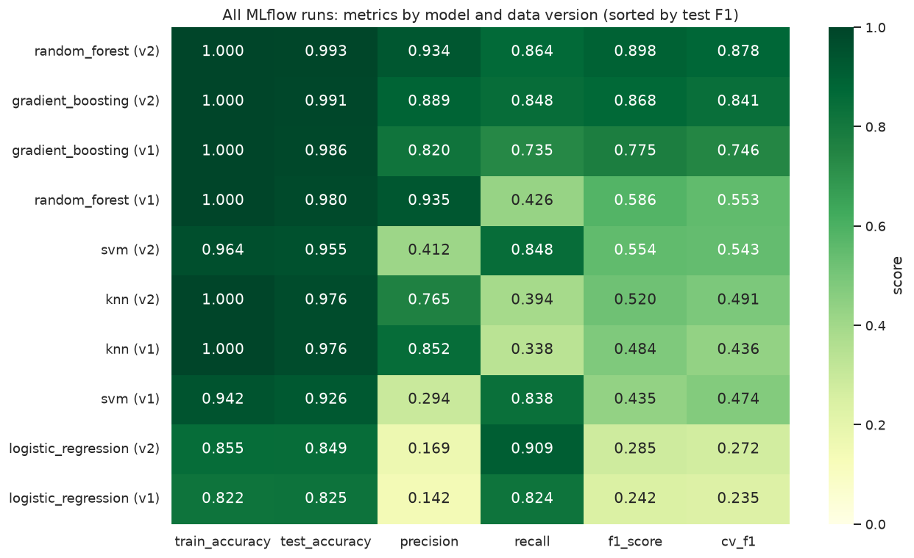

# MLOps Pipeline: AI4I 2020 Predictive Maintenance

CIA1 MLOps assignment: a basic end-to-end MLOps pipeline that predicts milling-machine failure from sensor data.

- **Dataset:** [AI4I 2020 Predictive Maintenance](https://archive.ics.uci.edu/dataset/601/ai4i+2020+predictive+maintenance+dataset) (UCI, ID 601). It has 10,000 records, 14 columns and a 3.39% failure rate.
- **Models:** Logistic Regression, KNN, SVM, Random Forest, Gradient Boosting
- **Stack:** MLflow (tracking + Model Registry), DVC (data versioning), Kubeflow Pipelines SDK v2 (compiled and executed with the KFP local runner), Feast (feature store)
- **Notebook:** [`MLOps_CIA1_AI4I_Predictive_Maintenance.ipynb`](MLOps_CIA1_AI4I_Predictive_Maintenance.ipynb)

## Results

Failure-class metrics on the held-out 20% test split. The champion was selected by 5-fold CV F1 on the training data and registered in MLflow as `ai4i-failure-classifier@champion`.

| Model | Data version | Test accuracy | Precision | Recall | F1 | CV F1 |
|---|---|---|---|---|---|---|
| **Random Forest (champion)** | **v2 (preprocessed)** | **0.9935** | **0.9344** | **0.8636** | **0.8976** | **0.8780** |
| Gradient Boosting | v2 | 0.9915 | 0.8889 | 0.8485 | 0.8682 | 0.8405 |
| Gradient Boosting | v1 (original) | 0.9855 | 0.8197 | 0.7353 | 0.7752 | 0.7459 |
| Random Forest | v1 | 0.9795 | 0.9355 | 0.4265 | 0.5859 | 0.5533 |
| SVM | v2 | 0.9549 | 0.4118 | 0.8485 | 0.5545 | 0.5433 |
| KNN | v2 | 0.9759 | 0.7647 | 0.3939 | 0.5200 | 0.4913 |
| KNN | v1 | 0.9755 | 0.8519 | 0.3382 | 0.4842 | 0.4365 |
| SVM | v1 | 0.9260 | 0.2938 | 0.8382 | 0.4351 | 0.4735 |
| Logistic Regression | v2 | 0.8491 | 0.1690 | 0.9091 | 0.2850 | 0.2724 |
| Logistic Regression | v1 | 0.8250 | 0.1421 | 0.8235 | 0.2424 | 0.2349 |

With the same models and hyperparameters, the preprocessed v2 dataset raised F1 for every model; Random Forest went from 0.586 to 0.898.

The Kubeflow pipeline (3 parallel training branches) ran end to end with the KFP local runner. It picked Gradient Boosting (F1 0.905 on its evaluation split), passed the F1 ≥ 0.7 quality gate and packaged the model.



## Assignment coverage

| Task | Where |
|---|---|
| 1. MLOps lifecycle diagram and stages | Notebook section 1, `reports/ml_lifecycle.png` |
| 2. MLflow: 5 models; params, train/test accuracy, P/R/F1; dataset, model and registry; comparison | Notebook sections 3 and 4.9 |
| 3. DVC: init, add, v1 original and v2 preprocessed, diff, switching, benefits | Notebook section 4, Git tags `data-v1.0` and `data-v2.0` |
| 4. Kubeflow: collection, validation, parallel training, evaluation, gated deployment | Notebook section 5, `pipelines/ai4i_pipeline.yaml`, `reports/kfp_local_run.log` |
| Monitoring stage | Notebook section 6 (KS test, PSI and prediction drift) |
| 5A. Feast: three features selected for the demo, a FeatureService, offline and online serving | Notebook section 7, `feature_repo/` |
| 5B. Cloud comparison: SageMaker, Vertex AI, Watson Studio | Notebook section 8 |

**Notes**
- **Kubeflow:** the compiled YAML contains the `dsl.If` quality gate. The KFP local runner does not execute `dsl.If` branches, so the locally executed variant applies the same threshold inside the deployment step. Kubernetes features (pods, resource limits, caching, retries) are only exercised on a real cluster.
- **Feast:** the three features are the ones selected for the Feast demonstration. The champion model uses all 11 v2 features.
- **Deployment:** no cloud deployment. The champion is registered and loaded from the MLflow Model Registry, and the pipeline packages the gated model for serving.

## Run it

The KFP local runner needs Linux or macOS, so the notebook runs in Docker (Docker Desktop on Windows works):

```bash
docker build -t mlops-cia1 .
docker run --rm -e GIT_AUTHOR_NAME="Your Name" -e GIT_AUTHOR_EMAIL="you@example.com" -e GIT_COMMITTER_NAME="Your Name" -e GIT_COMMITTER_EMAIL="you@example.com" -v "$(pwd):/work" mlops-cia1
```

The saved outputs show the original run from the scaffold commit. Re-running inside this repository prints "already exists" messages for the DVC init and tag steps, because those already exist in the Git history. To view the experiments and the registered champion:

```bash
mlflow ui --backend-store-uri sqlite:///mlflow.db
```
